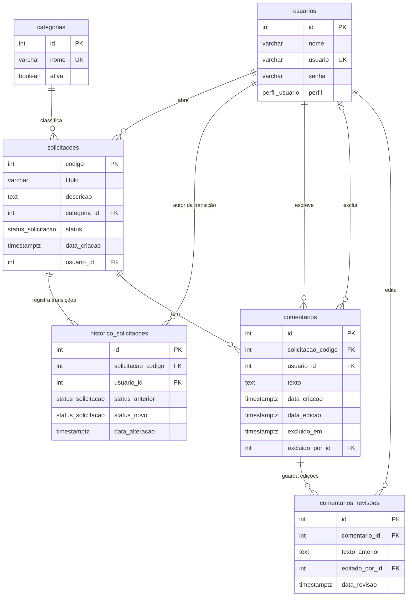

# Dicionário de dados

Descreve o banco de dados **como ele existe hoje**: 6 tabelas e 2 tipos enumerados, mais a tabela interna de controle das migrations. A fonte da verdade é [`prisma/schema.prisma`](../prisma/schema.prisma); o SQL sai das migrations em [`prisma/migrations/`](../prisma/migrations). Para as regras de negócio, veja [`use-cases.md`](use-cases.md); para o que a API expõe, [`api.md`](api.md).

## 1. Visão geral

| Item | Valor |
|---|---|
| SGBD | PostgreSQL 16 (Docker) |
| Acesso | Prisma 7 com `@prisma/adapter-pg` (único ponto de acesso: `PrismaService`) |
| Nomes | Código em `camelCase`, banco em `snake_case` (`@map` / `@@map`); tabelas no plural |
| Chaves primárias | `SERIAL` (`integer` com sequência) em todas as tabelas; em `solicitacoes` a PK se chama `codigo` |
| Datas | `timestamptz(6)`: instante em UTC com precisão de microssegundos; a API devolve ISO 8601 |
| Enums | Tipos nativos do Postgres, valores em ASCII maiúsculo (sem acento nem espaço) |
| Evolução | Só por migrations (`prisma migrate`); o SQL versionado nunca contém `DROP` |
| Tabela interna | `_prisma_migrations`: controle de quais migrations foram aplicadas (gerida pelo Prisma, fora do domínio) |

## 2. Diagrama entidade-relacionamento

## 3. Tipos enumerados

### `perfil_usuario`

| Valor | Significado |
|---|---|
| `SOLICITANTE` | Usuário comum: abre, edita e exclui as próprias solicitações (enquanto `ABERTO`) e conversa nos próprios chamados. |
| `ATENDENTE` | Gestor: vê todas as solicitações, assume e conclui chamados, comenta como responsável. **Não abre chamados.** |

### `status_solicitacao`

| Valor | Rótulo na tela | Significado |
|---|---|---|
| `ABERTO` | Aberto | Criada e ainda sem atendente. Único status em que o solicitante edita ou exclui. |
| `EM_ATENDIMENTO` | Em Atendimento | Um atendente assumiu (o responsável). Só ele conclui. |
| `CONCLUIDO` | Concluído | Encerrada. Não muda mais, e os comentários ficam somente leitura. |

O fluxo é estritamente sequencial: `ABERTO → EM_ATENDIMENTO → CONCLUIDO`. O rótulo "Em Atendimento" existe só na exibição; no banco o valor é `EM_ATENDIMENTO`.

## 4. Tabelas

### 4.1 `usuarios`

Cadastro de quem acessa o sistema. Não há tela de cadastro: os usuários vêm só do seed.

| Coluna | Tipo | Nulo | Padrão | Restrição | Descrição |
|---|---|---|---|---|---|
| `id` | `integer` | não | sequência | PK | Identificador. |
| `nome` | `varchar(255)` | não | | | Nome de exibição. |
| `usuario` | `varchar(255)` | não | | `UNIQUE` | Login no padrão `nome.sobrenome` (ex.: `atendente.um`). |
| `senha` | `varchar(255)` | não | | | **Hash bcrypt** da senha (custo 10); a senha nunca é guardada nem devolvida em texto. |
| `perfil` | `perfil_usuario` | não | `SOLICITANTE` | | Define as permissões (seção 3). |

Índices: `usuarios_pkey` (`id`), `usuarios_usuario_key` (único em `usuario`, usado no login).

### 4.2 `categorias`

Áreas de negócio (setores) que classificam as solicitações. Também só vêm do seed.

| Coluna | Tipo | Nulo | Padrão | Restrição | Descrição |
|---|---|---|---|---|---|
| `id` | `integer` | não | sequência | PK | Identificador. |
| `nome` | `varchar(255)` | não | | `UNIQUE` | Nome do setor (TI, RH, Compras, Financeiro, Infraestrutura). |
| `ativa` | `boolean` | não | `true` | | Exclusão lógica: categoria inativa some de `GET /categorias` e **não pode ser usada em novas solicitações**, mas as já registradas continuam válidas. |

Índices: `categorias_pkey` (`id`), `categorias_nome_key` (único em `nome`).

### 4.3 `solicitacoes`

Núcleo transacional: cada linha é um chamado.

| Coluna | Tipo | Nulo | Padrão | Restrição | Descrição |
|---|---|---|---|---|---|
| `codigo` | `integer` | não | sequência | PK | Código do chamado (o "#" exibido na tela). |
| `titulo` | `varchar(255)` | não | | | Assunto. Gravado sem espaços nas pontas. |
| `descricao` | `text` | não | | | Detalhes. O tipo não limita; a API recusa mais de **3.500** caracteres. |
| `categoria_id` | `integer` | não | | FK → `categorias.id` | Setor escolhido. |
| `status` | `status_solicitacao` | não | `ABERTO` | | Situação atual (seção 3). |
| `data_criacao` | `timestamptz(6)` | não | `CURRENT_TIMESTAMP` | | Abertura, preenchida automaticamente. |
| `usuario_id` | `integer` | não | | FK → `usuarios.id` | Solicitante dono (vem do token, nunca do corpo da requisição). |

Índices e uso:

| Índice | Colunas | Para quê |
|---|---|---|
| `solicitacoes_pkey` | `codigo` | Acesso por código. |
| `solicitacoes_usuario_id_data_criacao_idx` | `usuario_id, data_criacao` | Listagem do solicitante e dashboard por período. |
| `solicitacoes_categoria_id_idx` | `categoria_id` | Filtro e agrupamento por setor. |
| `solicitacoes_status_idx` | `status` | Filtro por status e contagens. |
| `solicitacoes_data_criacao_idx` | `data_criacao` | Ordenação e filtro por período. |

**Informações derivadas (não existem como coluna):** o **atendente responsável**, a **data de conclusão** e a **última atualização** saem de `historico_solicitacoes`. O responsável é quem fez a primeira transição para `EM_ATENDIMENTO`; a conclusão é a transição para `CONCLUIDO`; a última atualização é a data da última transição (ou `data_criacao`, se nunca mudou). Isso evita duplicar dado e garante uma única fonte.

### 4.4 `historico_solicitacoes`

Trilha de auditoria das mudanças de status. Cada criação ou transição gera uma linha, na mesma transação da escrita. Também resolve a relação N:M temporal entre solicitações e atendentes (uma solicitação passa por vários atores; um atendente altera várias solicitações).

| Coluna | Tipo | Nulo | Padrão | Restrição | Descrição |
|---|---|---|---|---|---|
| `id` | `integer` | não | sequência | PK | Identificador. |
| `solicitacao_codigo` | `integer` | não | | FK → `solicitacoes.codigo`, **`ON DELETE CASCADE`** | Chamado afetado. |
| `usuario_id` | `integer` | não | | FK → `usuarios.id` | Quem fez a alteração (o solicitante na criação; o atendente nas transições). |
| `status_anterior` | `status_solicitacao` | **sim** | | | Status antes da mudança; `NULL` na linha de criação. |
| `status_novo` | `status_solicitacao` | não | | | Status depois da mudança. |
| `data_alteracao` | `timestamptz(6)` | não | `CURRENT_TIMESTAMP` | | Instante exato da operação. |

Índices e uso:

| Índice | Colunas | Para quê |
|---|---|---|
| `historico_solicitacoes_pkey` | `id` | Identificação. |
| `historico_solicitacoes_solicitacao_codigo_idx` | `solicitacao_codigo` | Histórico de um chamado. |
| `historico_solicitacoes_usuario_id_idx` | `usuario_id` | Alterações de um usuário. |
| `historico_solicitacoes_status_novo_solicitacao_codigo_idx` | `status_novo, solicitacao_codigo` | Descobrir o responsável e a data de conclusão, e filtrar por atendente (listagem e dashboard). |

Regras: linhas **nunca são editadas nem apagadas isoladamente**; só somem junto com o chamado (UC04, o solicitante excluindo uma solicitação `ABERTO`).

### 4.5 `comentarios`

Conversa dentro do chamado, entre o solicitante dono e o atendente responsável (UC08).

| Coluna | Tipo | Nulo | Padrão | Restrição | Descrição |
|---|---|---|---|---|---|
| `id` | `integer` | não | sequência | PK | Identificador; crescente, por isso serve de cursor (`proxComentario`) na listagem. |
| `solicitacao_codigo` | `integer` | não | | FK → `solicitacoes.codigo`, **`ON DELETE CASCADE`** | Chamado ao qual pertence. |
| `usuario_id` | `integer` | não | | FK → `usuarios.id` | Autor. |
| `texto` | `text` | não | | | Mensagem. A API aceita de 1 a **2.000** caracteres, sem espaços nas pontas. |
| `data_criacao` | `timestamptz(6)` | não | `CURRENT_TIMESTAMP` | | Envio. |
| `data_edicao` | `timestamptz(6)` | sim | | | Data da última edição; `NULL` se nunca foi editado (a tela mostra "editado"). |
| `excluido_em` | `timestamptz(6)` | sim | | | **Exclusão lógica:** preenchido quando o autor exclui. |
| `excluido_por_id` | `integer` | sim | | FK → `usuarios.id`, `ON DELETE SET NULL` | Quem excluiu (hoje sempre o autor). |

Índices e uso:

| Índice | Colunas | Para quê |
|---|---|---|
| `comentarios_pkey` | `id` | Identificação. |
| `comentarios_solicitacao_codigo_id_idx` | `solicitacao_codigo, id` | Listar a conversa de um chamado em ordem e buscar só os novos (`id > cursor`). |
| `comentarios_usuario_id_idx` | `usuario_id` | Comentários de um usuário. |

Regras: toda consulta de leitura da aplicação filtra `excluido_em IS NULL`; um comentário excluído não aparece na lista, no `total` nem em `totalComentarios`, e não pode mais ser editado ou excluído (404). Comentar num chamado `CONCLUIDO` ou editar/excluir nele é recusado (409).

### 4.6 `comentarios_revisoes`

Histórico de edições dos comentários. Uma linha por edição, com o texto que valia **antes** dela.

| Coluna | Tipo | Nulo | Padrão | Restrição | Descrição |
|---|---|---|---|---|---|
| `id` | `integer` | não | sequência | PK | Identificador. |
| `comentario_id` | `integer` | não | | FK → `comentarios.id`, **`ON DELETE CASCADE`** | Comentário editado. |
| `texto_anterior` | `text` | não | | | Texto antes da edição. |
| `editado_por_id` | `integer` | não | | FK → `usuarios.id` | Quem editou (hoje sempre o autor). |
| `data_revisao` | `timestamptz(6)` | não | `CURRENT_TIMESTAMP` | | Quando a edição ocorreu. |

Índices: `comentarios_revisoes_pkey` (`id`), `comentarios_revisoes_comentario_id_idx` (`comentario_id`, para listar as versões de um comentário).

Regras: gravada na mesma transação da edição; edição recusada (403, 409 ou validação) não gera linha. **Auditoria interna:** nem `excluido_em`/`excluido_por_id` nem as revisões são expostos pela API ou pelo front; a consulta é direta no banco.

## 5. Relacionamentos e integridade referencial

| Origem (N) | Destino (1) | Coluna | `ON DELETE` | Observação |
|---|---|---|---|---|
| `solicitacoes` | `usuarios` | `usuario_id` | `RESTRICT` | Não há exclusão de usuários. |
| `solicitacoes` | `categorias` | `categoria_id` | `RESTRICT` | Categoria sai de uso por `ativa = false`, não por exclusão. |
| `historico_solicitacoes` | `solicitacoes` | `solicitacao_codigo` | **`CASCADE`** | Necessário para o UC04 (excluir a solicitação leva o histórico). |
| `historico_solicitacoes` | `usuarios` | `usuario_id` | `RESTRICT` | |
| `comentarios` | `solicitacoes` | `solicitacao_codigo` | **`CASCADE`** | Excluir o chamado leva os comentários. |
| `comentarios` | `usuarios` | `usuario_id` | `RESTRICT` | Autor. |
| `comentarios` | `usuarios` | `excluido_por_id` | `SET NULL` | Quem excluiu. |
| `comentarios_revisoes` | `comentarios` | `comentario_id` | **`CASCADE`** | |
| `comentarios_revisoes` | `usuarios` | `editado_por_id` | `RESTRICT` | |

Todas as FKs usam `ON UPDATE CASCADE`. **Consequência:** excluir uma solicitação (permitido só em `ABERTO`, só pelo dono) apaga também comentários, revisões e histórico; a trilha de auditoria não sobrevive à exclusão do chamado inteiro.

### O que o banco garante e o que fica na aplicação

| Garantido pelo banco | Garantido pela aplicação (services e validação) |
|---|---|
| Tipos, nulidade e domínio dos enums | Fluxo de status sequencial e registro no histórico |
| Unicidade de `usuarios.usuario` e `categorias.nome` | Só o solicitante dono edita/exclui, e só em `ABERTO` |
| Integridade das FKs e cascatas | Dono do chamado (quem assumiu) e trava de concorrência (`UPDATE ... WHERE` condicional) |
| | Quem pode comentar, chamado concluído somente leitura, exclusão lógica e revisões |
| | Tamanhos de texto (`titulo` 255, `descricao` 3.500, `texto` 2.000) e ids de 1 a 2.147.483.647 |
| | Categoria inativa não aceita novas solicitações |

## 6. Dados iniciais (seed)

Aplicados por `npx prisma db seed` (e automaticamente na subida do Docker); idempotentes (`upsert`), então rodar de novo não duplica nem altera registros existentes.

| Tabela | Registros |
|---|---|
| `categorias` | TI, RH, Compras, Financeiro, Infraestrutura (todas ativas). |
| `usuarios` | `atendente.um` e `atendente.dois` (`ATENDENTE`); `solicitante.um` e `solicitante.dois` (`SOLICITANTE`). Senha de todos definida por `SEED_PASSWORD` (padrão de desenvolvimento: `123456`), guardada como hash bcrypt. |

**Dados de demonstração (opcional):** `npm run seed:demo` cria 150 chamados espalhados em ~150 dias, com histórico coerente e conversas em 81 deles (marcados com `(dados de demonstração)` na descrição). `-- --reset` recria; `-- --se-vazio` só semeia se não houver nenhum chamado (usado no Docker com `SEED_DEMO=true`).

## 7. Diferenças em relação ao script do Memorial Técnico

| Ponto | Memorial | Implementação | Motivo |
|---|---|---|---|
| Valores de `status_solicitacao` | `'Aberto'`, `'Em Atendimento'`, `'Concluído'` | `ABERTO`, `EM_ATENDIMENTO`, `CONCLUIDO` | ASCII sem espaço nem acento: seguro em código, URL e JSON; o rótulo amigável fica na tela. |
| Tipo de data | `TIMESTAMP` (sem fuso), `data_criacao` com padrão mas permitindo nulo | `TIMESTAMPTZ(6)` e `NOT NULL` | Instante inequívoco independente do fuso do servidor; o dashboard converte para o fuso do usuário. |
| Histórico ao excluir solicitação | FK sem ação (bloquearia a exclusão) | `ON DELETE CASCADE` | Sem isso o UC04 falharia assim que existisse o histórico da criação. |
| Índices | Só PK e `UNIQUE` | 10 índices de apoio (seção 4) | Filtros da listagem e agregações do dashboard sem varredura completa. |
| Tabelas | 4 | 6 (`comentarios`, `comentarios_revisoes`) | Comunicação no chamado (UC08) com trilha de auditoria. |
| Script SQL | Um script com `DROP` e seed | Migrations versionadas, sem `DROP`; seed em `prisma/seed.ts` | Evolução controlada e segura; resetar só por `prisma migrate reset`. |
| Dados de seed | `admin` e `joao.solicitante` com hash fictício | 4 usuários `nome.sobrenome` com hash bcrypt real | O login funciona de imediato, com um atendente a mais para testar a trava de concorrência. |
